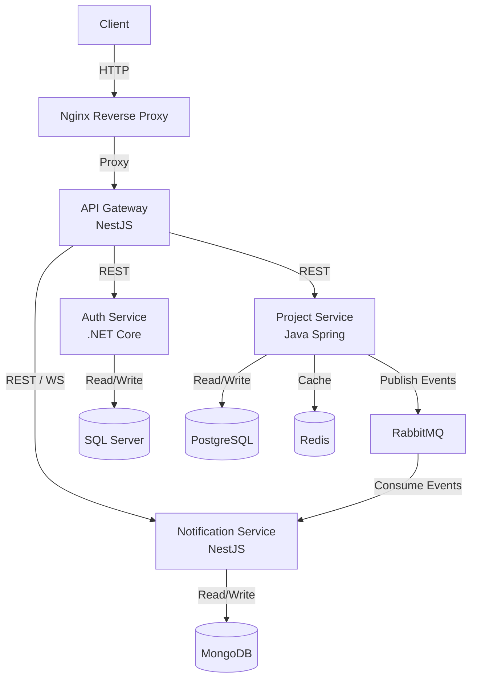

# Architectural Diagram

```mermaid
flowchart TD
    Client[Client] -->|HTTP| Nginx[Nginx Reverse Proxy]
    Nginx -->|Proxy| Gateway[API Gateway <br/>NestJS]
    
    Gateway -->|REST| AuthSvc[Auth Service <br/>.NET Core]
    Gateway -->|REST| ProjectSvc[Project Service <br/>Java Spring]
    Gateway -->|REST / WS| NotifSvc[Notification Service <br/>NestJS]
    
    ProjectSvc -->|Publish Events| RabbitMQ[RabbitMQ]
    RabbitMQ -->|Consume Events| NotifSvc
    
    AuthSvc -->|Read/Write| SQLServer[(SQL Server)]
    ProjectSvc -->|Read/Write| Postgres[(PostgreSQL)]
    ProjectSvc -->|Cache| Redis[(Redis)]
    NotifSvc -->|Read/Write| MongoDB[(MongoDB)]
```
